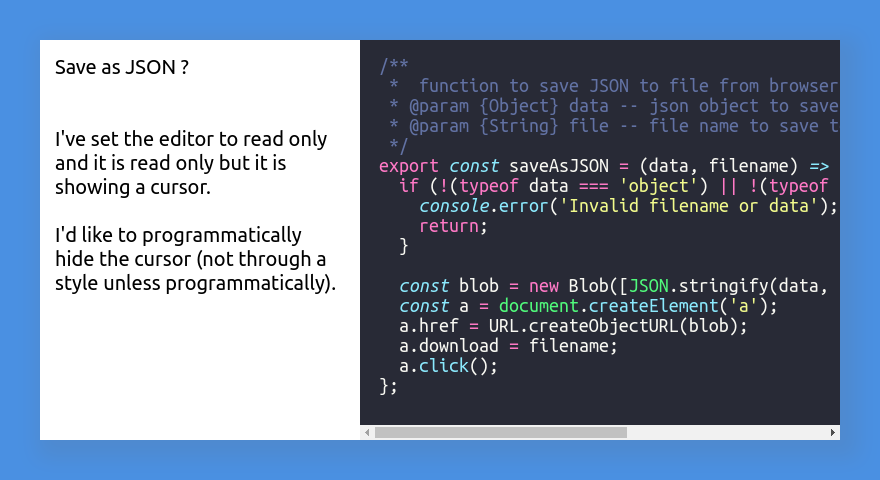
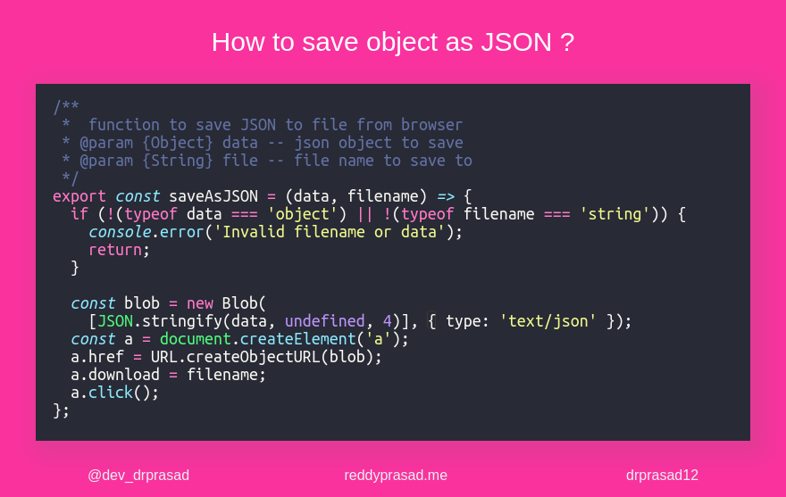
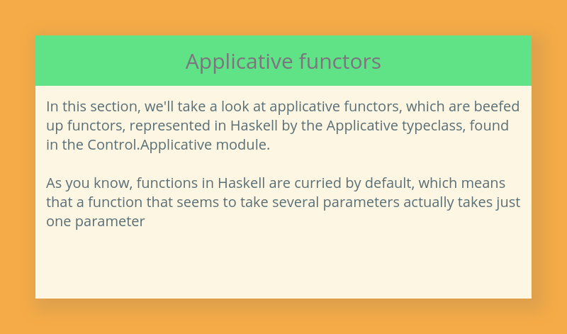

## no-name-yet

As for now, i have no f\*\*king idea on what to name the project

I am really lazy to write README.md. For now i will add following line:

    This project is inspired from cardon.now.sh and samantha ming's tidbits

and of course, some screenshots

#### Todo

- [ ] Reset colors functionality
- [ ] Add placeholder text for content and code editors
- [ ] Add way to increase padding of card (vertically and horizontally)
- [ ] Funtionality to add/remove footer (may be header) for any template
- [ ] Multiple font support (both content/editor)
- [ ] Should we switch to monaco-editor ??????
- [ ] Add names for templates
- [ ] What about facebook share ??
- [ ] For f\*\*k sake, we need emoji support first

#### References:

- https://github.com/mrred85/one-themes/blob/master/theme-one_dark.js
- https://github.com/ajaxorg/ace-builds/tree/master/src-noconflict
- https://github.com/ajaxorg/ace/issues/1518
- https://stackoverflow.com/questions/24992069/ace-editor-use-extra-themes-customize-themes
- https://codepen.io/saigowthamr/pen/OZmWqW
- https://github.com/tsayen/dom-to-image/issues/59
- https://github.com/securingsincity/react-ace/issues/415
- https://onlinejournalismblog.com/2015/02/11/how-to-make-a-tweetable-image-in-your-blog-post/
